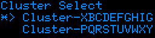

# k8dget
Kubernetes gadget

Dumping ground for ESP32 based kubernetes gadget.

## Functions
* Select cluster
* Select resource
  * Pods
    * View status
    * Delete
  * Deployment
    * View status
    * Scale
  * StatefulSets
    * View status
    * Scale

# Mockups



```cpp
    void draw(U8G2 u8g2) {
        u8g2.setDrawColor(1);
        u8g2.setFont(u8g2_font_6x12);
        u8g2.drawStr(1,8,"Cluster Select");
        u8g2.setFont(u8g2_font_6x10);
        u8g2.drawStr(1,18,"*> Cluster-XBCDEFGHIG");
        u8g2.drawStr(1,28,"   Cluster-PQRSTUVWXY");
   }
```

## Equipment
* SoC: ESP32
* Display: SSD1306 128x32
* Input:
  * EC11 Rotory encoder
  * SPST Micro tachtile switch
